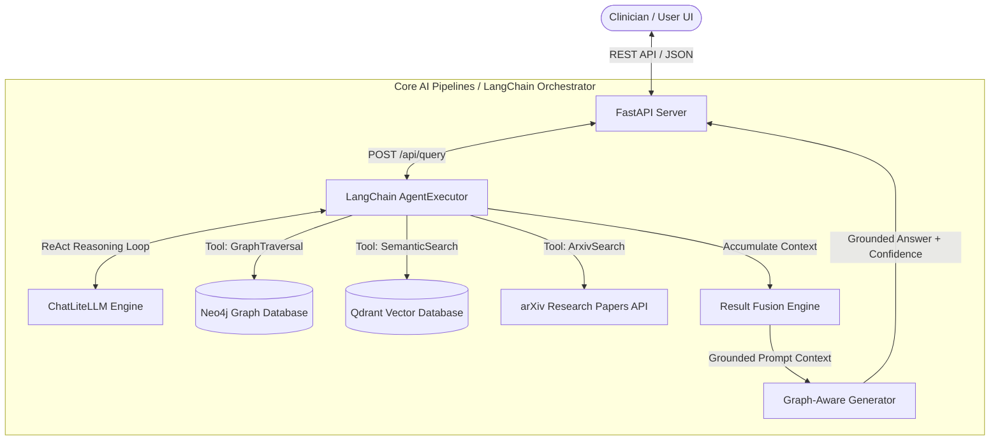
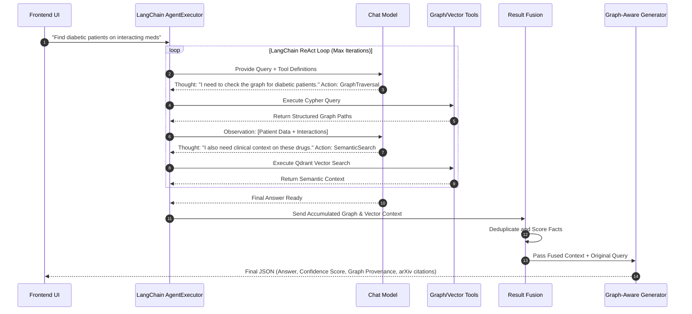

# Medical GraphRAG — Comprehensive System Flow & Architecture

This document provides a highly detailed overview of the **MedGraphRAG (Medical Graph-based Retrieval-Augmented Generation)** architecture, pipelines, and data flows. This system pushes the boundaries of standard RAG by combining the deterministic reliability of structured clinical relationships (Neo4j) with the semantic richness of unstructured vector search (Qdrant), orchestrated seamlessly by a **LangChain ReAct Agent**.

This document is specifically structured to support presentation and technical deep-dives.

---

## 1. System Architecture Overview

The system is logically divided into three primary layers:
1. **Frontend Interface (Vite + React)**: The clinician-facing UI for dashboards, graph visualization, and interactive queries.
2. **Backend API (FastAPI)**: The routing layer that connects the UI to the AI reasoning engine.
3. **Core AI Orchestration Layer (LangChain + Neo4j + Qdrant)**: The "brain" of the system that plans retrieval steps, executes graph and vector queries, and synthesizes answers.

---

## 2. Deep Dive: Core Data Flow Steps

### A. Ingestion & Embedding Pipeline (Data Preparation)
Before the system can answer queries, medical knowledge must be formally structured:

1. **Knowledge Graph Ingestion (Neo4j)**: 
   - Uses an OWL Ontology designed in Protégé to enforce strict medical relationships.
   - Nodes: `Patient`, `Drug`, `Condition`, `HealthcareProvider`.
   - Edges: `HAS_CONDITION`, `TAKES_DRUG`, `INTERACTS_WITH`, `CONTRAINDICATED_FOR`.
   - **Reasoning**: Automated classification occurs here (e.g., detecting "High-Risk Patients" based on overlapping condition-drug interactions).

2. **Vector Space Ingestion (Qdrant)**:
   - Deep semantic embeddings of patient records, drug documentation, and ICD-10 condition categories.
   - Text chunks are mapped using high-dimensional embeddings and indexed into specialized collections (`patients`, `drugs`, `conditions`).
   - Ensures that colloquial queries (e.g., "stomach ache meds") map correctly to clinical terms (e.g., "gastrointestinal adverse effects").

---

### B. The LangChain Orchestration Flow (`/api/query`)

The most critical upgrade to the system is the implementation of a **LangChain ReAct (Reasoning and Acting) Agent** as the central orchestrator.

When a query is submitted, the system does not simply retrieve data; it *reasons* about how to retrieve it:

---

## 3. Component Breakdown & Implementation Details

### 1. LangChain Orchestration (`src/graphrag/orchestrator.py`)
- **AgentExecutor**: Replaces static loops. Handles tool dispatch, error correction (if a tool fails, the agent retries), and enforces maximum iteration limits.
- **Dynamic Tool Calling**: Uses `@Tool` decorators to expose backend Python functions natively to the LLM. 
- **Prompt Engineering**: The `PromptTemplate` enforces a **CRITICAL RULE**: The agent *must* call `GraphTraversal` to ensure deterministic medical facts are checked before relying solely on semantic vector search.

### 2. Retrieval Engines (`src/graphrag/retrievers/`)
- **`graph_retriever.py`**: Executes complex Cypher queries. Capable of multi-hop traversal, such as finding a 2-hop chain where Drug A interacts with Drug B, and Drug B is taken by Patient X.
- **`vector_retriever.py`**: Handles semantic fuzzy searches via Qdrant. Crucial for matching unstructured symptom descriptions to structured disease profiles.
- **`arxiv_retriever.py`**: Acts as a live fact-checker, pulling the latest peer-reviewed medical papers directly from arXiv to substantiate the LLM's claims.

### 3. Context Processing & Synthesis (`src/graphrag/`)
- **`fusion.py`**: The unsung hero of the pipeline. Since the LangChain agent might fetch overlapping data from the Graph and Vector databases, the Fusion engine deduplicates, scores, and merges facts into a clean, unified context window to prevent LLM hallucination.
- **`generator.py`**: Takes the fused context and forces the final generation step. It calculates a definitive Confidence Score (Low/Medium/High) and generates strict provenance mappings so every sentence in the UI can be traced back to a specific Graph Node or Paper.

### 4. Interactive Web Interface (`frontend/`)
- **Dashboard**: High-level system vitals, graph network metrics, and risk overviews.
- **Query Interface**: The clinician's playground. Supports side-by-side **Comparison Mode** (`/api/query/compare`), which runs standard vector-RAG simultaneously against the new LangChain GraphRAG to visibly demonstrate the superiority of graph-grounded answers.
- **Patient Database & Visualizer**: Interactive network graphs mapping out a specific patient's conditions and medications in real-time.

---

## 4. Why This Architecture Excels (Presentation Talking Points)

1. **Eradicates Hallucination in Critical Scenarios**: Standard RAG might "guess" a drug interaction because the words appear near each other in a textbook. MedGraphRAG *proves* the interaction by traversing a verified edge in Neo4j.
2. **Autonomous Reasoning**: Thanks to LangChain, the system isn't hardcoded. If a clinician asks a multi-part question, the agent independently decides to query the graph for part one, and the vector store for part two.
3. **Full Explainability**: Black-box AI is unacceptable in healthcare. The Fusion and Generator layers guarantee that every claim is backed by traceable "Provenance"—showing exactly which nodes, edges, or arXiv papers justify the decision.
